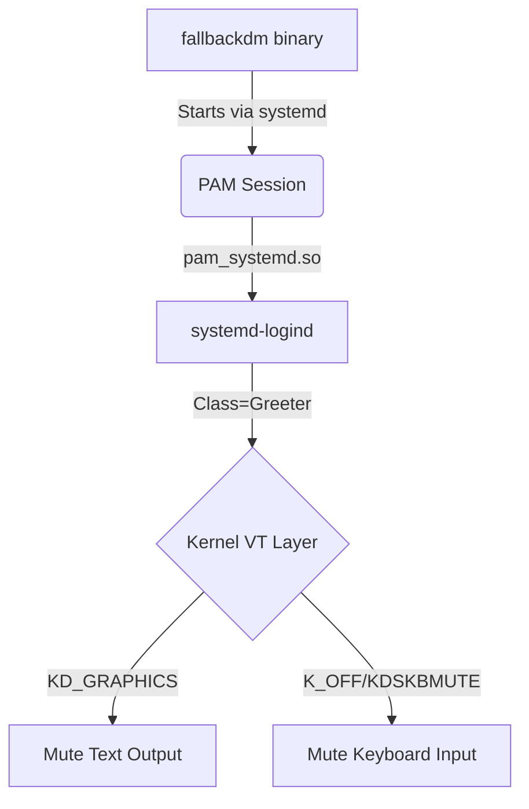

# fallbackdm

> CAUTION: THIS IS CURRENTLY A POC ONLY

**fallbackdm** is a minimal, headless display manager that exists solely to **own a seat and VT when no graphical session is running**.

It prevents unintended keyboard input from reaching `getty` or the kernel VT layer by registering a proper **greeter session** with `systemd-logind`. This triggers the kernel to switch the VT to graphics mode and mute the keyboard handler—all without actually starting X11 or Wayland.

---

## The Problem

On modern Linux systems:

* **Input Leakage:** If no graphical session is active, the kernel VT subsystem remains in text mode (`KD_TEXT`). Input injected via `uinput` or remote virtualization leaks into the active VT, potentially triggering `getty` login attempts or `Ctrl+Alt+Fn` switches.
* **Lack of Ownership:** Graphical compositors avoid this by registering with `systemd-logind`, which "mutes" the TTY. When no compositor is running, the VT is "unowned" and reverts to legacy text behavior.

**fallbackdm fills this gap by acting as a silent, headless placeholder session.**

Note: `fallbackdm` is very likely not needed when kmscon is running. This is very likely the solution that works natively with Fedora 44+ (see [phoronix.com](https://www.phoronix.com/news/Fedora-44-Considers-KMSCON)).

---

## What fallbackdm Does

* **Delegates to logind:** Registers a `class=greeter` session via PAM.
* **Silences the VT:** Leverages standard `logind` behavior to switch the VT to `KD_GRAPHICS` and mute the keyboard handler (equivalent to `KDSKBMUTE` or `K_OFF`).
* **Preserves Semantics:** Maintains correct seat and session ownership so the system behaves like a "graphical" system even when headless.
* **Low Impact:** Once a real display manager (GDM, SDDM, etc.) starts, `logind` manages the transition, and `fallbackdm` yields.

---

## What fallbackdm Does *Not* Do

* ❌ **No UI:** It does not launch X11, Wayland, or any graphical interface.
* ❌ **No Hardware Access:** It does not open `/dev/dri/cardX` or `/dev/input/event*`. It requires no device permissions, minimizing the attack surface.
* ❌ **No Manual IOCTLs:** It avoids direct VT manipulation by letting `pam_systemd` communicate the requirements to the kernel.

---

## Architecture Overview



---

## Configuration

### 1. PAM Configuration

Create `/etc/pam.d/fallbackdm`. This is mandatory for `logind` to track the session correctly.

```text
# /etc/pam.d/fallbackdm
auth     required  pam_permit.so
account  required  pam_permit.so
session  required  pam_systemd.so class=greeter type=wayland

```

### 2. systemd Service

`fallbackdm` should run when no other display manager is active.

```ini
[Unit]
Description=Fallback Display Manager
After=systemd-user-sessions.service
Conflicts=display-manager.service

[Service]
ExecStart=/usr/bin/fallbackdm
PAMName=fallbackdm
TTYPath=/dev/tty1
StandardInput=tty
Restart=always

[Install]
WantedBy=multi-user.target

```

---

## Relationship to Other Projects

* **Display Managers (GDM, SDDM, greetd):** Full stacks that spawn user sessions.
* **Greeters (gtkgreet, tuigreet):** The UI layer for display managers.
* **fallbackdm:** A "null" display manager. It provides the **infrastructure** of a graphical session (seat/VT ownership) without the **overhead** of a graphical environment.

---

## Future Ideas

* **Health Monitoring:** Heartbeat for input-virtualization daemons.
* **Minimal Status:** Optional one-line status reporting to the TTY before muting.
* **Dynamic Exit:** Automatically exit when a specific DRM device is hotplugged.

## License

MIT